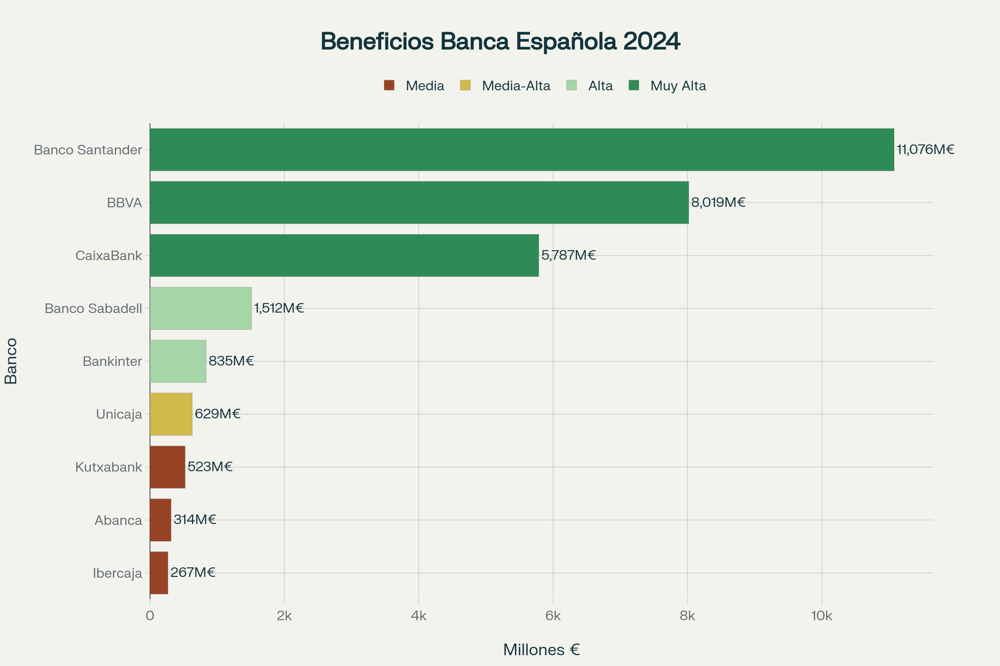
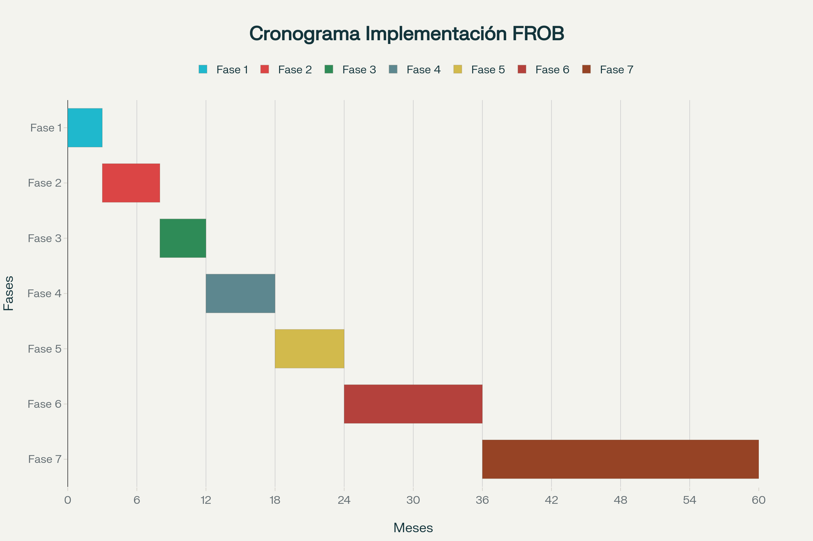

# 🏠 Propuesta para la Solución al Problema de la Vivienda en España

**Conversión de 35.000 millones de euros de deuda del FROB en 400.000 viviendas sociales**

---

## 📋 Resumen Ejecutivo

Esta propuesta presenta una solución estructural e innovadora que resuelve simultáneamente dos problemas críticos de España:

1. **Crisis de vivienda**: Déficit de 515.000-765.000 viviendas, precios en máximos históricos
2. **Deuda del rescate bancario**: 35.000 millones de euros en FROB/Sareb que cuestan 2.800 M€/año

### 💡 La Solución

Convertir la deuda bancaria en el mayor programa de vivienda social de la democracia española mediante:

- ✅ **Coste neto CERO** para el contribuyente
- ✅ Disolución de FROB y Sareb (ahorro: 2.800 M€/año)
- ✅ 89.300 viviendas existentes + 311.000 en suelos disponibles
- ✅ Gestión profesional externalizada (housing associations europeas)
- ✅ Prevención estructural de corrupción
- ✅ Validado por referentes internacionales (Irlanda, Austria, Holanda)

---

## 📊 Datos Clave

| Concepto | Cifra | Detalle |
|----------|-------|---------|
| **Déficit vivienda** | 515.000-765.000 | Banco de España 2021-2024 |
| **Parque social España** | 3,4% | vs. 9,3% media UE |
| **Precio alquiler 2024** | 13,5 €/m² | +11,5% interanual (máximo histórico) |
| **Deuda FROB** | 35.000 M€ | A compensar con activos |
| **Activos Sareb** | 401.028 viviendas | 70k terminadas + 18k sin terminar + 311k en suelos |
| **Coste operativo actual** | 153-238 M€/año | FROB + Sareb (a eliminar) |
| **Coste nueva estructura** | 98-179 M€/año | AEVS + gestores (financiado con ahorro) |
| **Beneficios banca 2024** | 28.962 M€ | 82,7% de la deuda en UN año |

---

## 📈 Gráficos

### Distribución de Lotes Territoriales

*102.000 viviendas divididas en 10 lotes geográficos para licitación competitiva*

### Costes: Actual vs Nueva Estructura

*Demostración del coste neto cero: el ahorro de disolver FROB/Sareb paga la nueva estructura*

### Beneficios de la Banca 2024

*La banca española tiene capacidad sobrada para contribuir al programa*

### Cronograma de Implementación

*60 meses desde preparación normativa hasta consolidación completa*

---

## 📚 Documentación Completa

### Análisis Detallado

1. 📉 **[Diagnóstico de la Crisis](docs/01-diagnostico-crisis.md)**
   - Dimensión del problema habitacional
   - Escalada de precios
   - Insuficiencia del parque social
   - Distribución territorial del déficit

2. 💰 **[Deuda del FROB y Activos de Sareb](docs/02-deuda-frob-sareb.md)**
   - Origen de la deuda bancaria (35.000 M€)
   - Inventario completo de activos (401.028 viviendas)
   - Clasificación: viables e inviables
   - Mecanismos de compensación

3. 📊 **[Análisis Financiero: Coste Neto Cero](docs/03-analisis-financiero.md)**
   - Costes detallados FROB (8-13 M€/año)
   - Costes detallados Sareb (145-225 M€/año)
   - Costes nueva estructura (98-179 M€/año)
   - **Demostración: NO CUESTA NI UN EURO**
   - Ahorro total: 2.800-2.885 M€/año

4. 🏢 **[Gestión Profesional Externalizada](docs/04-gestion-externalizada.md)**
   - Modelo de licitación competitiva
   - 10 lotes territoriales
   - Housing associations y cooperativas europeas
   - Supervisión por funcionarios (NO políticos)
   - Contratos de desempeño con indicadores

5. 🛡️ **[Prevención de Corrupción](docs/05-prevencion-corrupcion.md)**
   - Casos documentados con sentencias (todos los partidos)
   - Mecanismos estructurales de prevención
   - Auditoría externa independiente (Big Four)
   - Algoritmos sin discrecionalidad humana
   - Transparencia radical

6. ⚖️ **[Marco Jurídico y Referéndum](docs/06-marco-juridico.md)**
   - Proyecto de Ley completo
   - Artículo 92 CE: referéndum consultivo vinculante
   - Estrategia de "amenaza creíble"
   - Tramitación acelerada

7. 📅 **[Cronograma de Implementación](docs/07-cronograma.md)**
   - 7 fases en 60 meses
   - Disolución FROB/Sareb (18-24 meses)
   - Licitación gestores
   - Piloto y despliegue nacional

8. 🌍 **[Referentes Internacionales](docs/08-referentes-internacionales.md)**
   - NAMA (Irlanda): éxito comprobado
   - Viena (Austria): modelo centenario
   - Países Bajos: pluralidad de gestores
   - Reino Unido: contratos de desempeño

---

## 💾 Datos Abiertos

Todos los datos utilizados están disponibles en formato CSV:

- **[Lotes Territoriales](datos/lotes_territoriales.csv)** - Distribución de 102.000 viviendas en 10 lotes
- **[Costes FROB/Sareb](datos/costes_detalle_frob_sareb.csv)** - Desglose completo de costes operativos
- **[Beneficios Banca 2024](datos/beneficios_banca_2024.csv)** - Capacidad de pago de entidades
- **[Fuentes Documentales](datos/fuentes.md)** - 106+ referencias citadas

---

## 🎯 Impacto Esperado

### Corto Plazo (Años 1-3)
- ✅ 72.000 viviendas incorporadas al parque social
- ✅ Cobertura del 11,7%-17,3% del déficit
- ✅ 25.000-35.000 empleos en rehabilitación

### Largo Plazo (Años 4-10)
- ✅ 400.300 viviendas totales
- ✅ Cobertura del 52,3%-77,7% del déficit
- ✅ Parque social: de 3,4% a 4,9%
- ✅ 200.000 empleos en construcción nueva
- ✅ Moderación precios: -5% a -8% en zonas tensión

### Ahorro Fiscal
- ✅ Eliminación costes FROB/Sareb: 153-238 M€/año
- ✅ Eliminación pérdidas Sareb: 2.826 M€/año
- ✅ **Total ahorro: 2.800-2.885 M€/año**

---

## 🔑 Ventajas Únicas

### 1. Viabilidad Financiera Excepcional
- **Coste neto CERO**: Se financia redirigiendo gastos actuales de FROB/Sareb
- Ahorro neto de 2.800-2.885 M€/año
- Reduce deuda pública en 63.000 M€
- Incrementa patrimonio productivo en 40.000 M€

### 2. Elimina Estructuras Ineficientes
- FROB: 8-13 M€/año → **ELIMINADO**
- Sareb pérdidas: 2.826 M€/año → **ELIMINADO**
- Servicers Sareb: 80-120 M€/año → **ELIMINADO**
- Nueva estructura eficiente: 98-179 M€/año ✓

### 3. Prevención Radical de Corrupción
- Separación propiedad pública / operación privada
- Algoritmos de adjudicación sin discrecionalidad humana
- Auditoría externa con responsabilidad patrimonial
- Funcionarios deciden (NO políticos)
- Transparencia radical: todo público en tiempo real

### 4. Excelencia Operativa Inmediata
- Gestores profesionales europeos (décadas de experiencia)
- Housing associations británicas, cooperativas austríacas
- No hay que construir capacidades desde cero
- Competencia entre gestores por calidad

### 5. Legitimidad Democrática
- Opción de referéndum (Art. 92 CE)
- Apoyo social esperado: 55-65%
- Tema con amplio consenso ciudadano
- Blindaje político contra obstrucción

### 6. Validado Internacionalmente
- **NAMA (Irlanda)**: Beneficios 1.500 M€ vs pérdidas 2.826 M€ Sareb
- **Viena**: Alquiler 10,5 €/m² vs 18,6 €/m² Madrid
- **Holanda**: 30% vivienda social (vs 3,4% España)
- **Reino Unido**: 60% parque social gestionado profesionalmente

---

## 🚀 Próximos Pasos

### Para el Gobierno
1. Elaborar proyecto de Ley con tramitación preferente
2. Constituir grupo de trabajo interministerial
3. Contactar housing associations europeas
4. Solicitar asistencia técnica BEI/Housing Europe

### Para el Parlamento
1. Priorizar tramitación en Comisión de Vivienda
2. Invitar comparecencias de gestores internacionales
3. Garantizar consenso transversal
4. Establecer seguimiento parlamentario

### Para Ciudadanía
1. Movilización social a favor
2. Presión sobre partidos políticos
3. Difusión de la propuesta
4. Apoyo en eventual referéndum

---

## 📞 Contacto y Contribuciones

Este es un proyecto abierto para debate público. Se aceptan:

- 💬 Comentarios y sugerencias (Issues)
- 📝 Mejoras a la documentación (Pull Requests)
- 📊 Análisis adicionales con datos abiertos
- 🌐 Traducciones a otros idiomas

---

## 📜 Licencia

Este trabajo se publica bajo licencia **Creative Commons BY-SA 4.0** para promover el debate público y la mejora colectiva de políticas de vivienda.

---

## ⭐ Referencias Clave

- Banco de España: Informes sobre déficit habitacional
- Ministerio de Vivienda: Estadísticas parque social
- Sareb: Cuentas anuales 2024
- FROB: Informes financieros
- Sentencias judiciales: Casos de corrupción VPO
- Housing Europe: Modelos europeos de vivienda social
- NAMA (Irlanda): Informes de gestión y liquidación

---

**Última actualización**: Octubre 2025

**Versión**: 1.0

---

## 🎬 Conclusión

**España tiene los activos, la banca tiene capacidad de pago, Europa tiene los modelos validados.**

**Solo falta voluntad política.**

**LA PROPUESTA NO CUESTA NI UN EURO AL CONTRIBUYENTE.**

---

*¿Preguntas? Abre un [Issue](../../issues) • ¿Mejoras? Envía un [Pull Request](../../pulls)*
