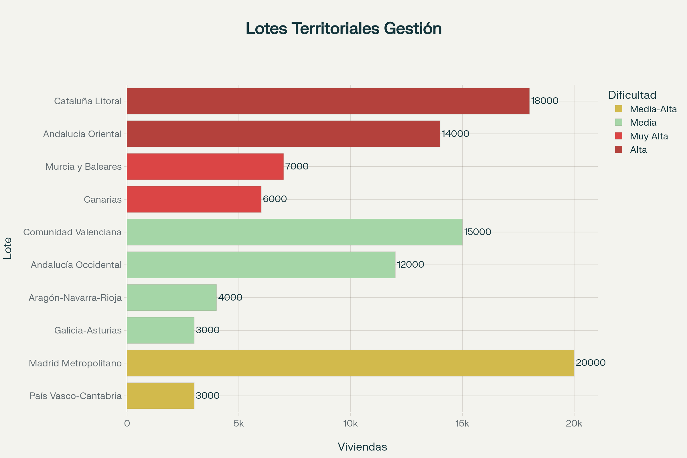

# Gestión Profesional Externalizada

## El Modelo Propuesto

La operación ordinaria del parque de vivienda social se **externaliza mediante contratos de gestión integral** con operadores profesionales especializados, seleccionados por licitación pública competitiva internacional.

**La AEVS es propietaria supervisora, NO gestora directa.**

---

## 10 Lotes Territoriales para Licitación

### Distribución del Parque (102.000 viviendas)

| Lote | Viviendas | % | Dificultad | Perfil |
|------|-----------|---|------------|--------|
| **1. Madrid Metropolitano** | 20.000 | 19,6% | Media-Alta | Alta densidad, demanda muy elevada |
| **2. Cataluña Litoral** | 18.000 | 17,6% | Alta | Presión turística, bilingüe |
| **3. Comunidad Valenciana** | 15.000 | 14,7% | Media | Mix urbano-costero |
| **4. Andalucía Oriental** | 14.000 | 13,7% | Alta | Turistificación extrema |
| **5. Andalucía Occidental** | 12.000 | 11,8% | Media | Ciudades medias |
| **6. Canarias** | 6.000 | 5,9% | Muy Alta | Insularidad, turismo |
| **7. Murcia y Baleares** | 7.000 | 6,9% | Muy Alta | Muy dispares |
| **8. Aragón-Navarra-Rioja** | 4.000 | 3,9% | Media | Ciudades medias |
| **9. Galicia-Asturias** | 3.000 | 2,9% | Media | Atlántico |
| **10. País Vasco-Cantabria** | 3.000 | 2,9% | Media-Alta | Cooperativismo fuerte |

### Criterios de División

- ✅ Volumen suficiente: 12.000-25.000 viviendas/lote (economías escala)
- ✅ Concentración geográfica: facilita gestión operativa
- ✅ Diversidad de operadores: evita monopolios
- ✅ Atracción de perfiles diferentes: grandes housing associations + cooperativas medianas

---

## Procedimiento de Licitación

### Publicación

**Concurso público internacional** mediante procedimiento abierto:
- Publicado en DOUE (Diario Oficial UE)
- Publicado en BOE
- Difusión en Housing Europe y redes especializadas

### Participantes Elegibles

Pueden licitar:
- 🏢 **Housing associations** europeas (Reino Unido, Irlanda)
- 🏗️ **Cooperativas de vivienda** con experiencia acreditada
- 🤝 **Empresas sociales** gestión inmobiliaria
- 🏛️ **Woningcorporaties** holandesas
- 🏘️ **Bauvereinigungen** austríacas
- 👥 **Consorcios** de varios operadores

### Requisitos Mínimos

- Experiencia gestionando mínimo 5.000 viviendas sociales
- Mínimo 5 años operando en sector
- Solvencia económica y técnica acreditada
- Referencias de administraciones públicas
- Certificaciones de calidad (ISO 9001, similares)

### Criterios de Adjudicación (Evaluación 0-100 puntos)

| Criterio | Peso | Detalle |
|----------|------|---------|
| **Solvencia técnica** | 30% | Experiencia, cualificación equipo, sistemas tecnológicos |
| **Precio** | 25% | Retribución solicitada (€/vivienda/año) |
| **Plan de trabajo** | 20% | Cronograma, estrategia, metodología |
| **Calificación equipo** | 15% | Arquitectos, trabajadores sociales, gestores |
| **Compromiso social** | 10% | Contratación local, formación, inserción |

---

## Objeto del Contrato de Gestión Integral

### Servicios Incluidos

**1. Recepción y puesta en servicio**
- Inventario detallado de viviendas
- Actas de estado de conservación
- Documentación jurídica completa

**2. Rehabilitación y adecuación**
- Ejecución de obras según especificaciones AEVS
- Supervisión técnica de obras
- Certificaciones y licencias

**3. Tramitación de solicitudes**
- Aplicación de baremos objetivos mediante algoritmos
- Verificación documental de requisitos
- Propuestas de adjudicación a AEVS

**4. Formalización de contratos**
- Alquiler social (mayoría de casos)
- Compraventa protegida (casos específicos)
- Contratos de acompañamiento social

**5. Gestión operativa del parque**
- ✅ Atención inquilinos (oficinas proximidad)
- ✅ Mantenimiento preventivo programado
- ✅ Mantenimiento correctivo (averías, reparaciones)
- ✅ Cobro de rentas y transferencia a AEVS
- ✅ Gestión de morosidad (planes de pago, mediación)
- ✅ Mediación en conflictos vecinales
- ✅ Seguros del parque

**6. Acompañamiento social**
- Trabajadores sociales en plantilla
- Visitas periódicas a inquilinos vulnerables
- Coordinación con servicios sociales municipales
- Programas de formación e inserción laboral

**7. Reporting y transparencia**
- Informes mensuales de indicadores
- Panel digital en tiempo real
- Auditorías trimestrales internas
- Atención quejas ciudadanas

---

## Retribución y Duración

### Retribución Estándar

**800-1.200 €/vivienda/año** (según servicios y complejidad territorial)

**Para 70.000-80.000 viviendas gestionadas**:
- **Coste total**: 56-96 M€/año
- **Financiación**: Ahorro de disolver FROB/Sareb (153-238 M€/año)

### Duración Contractual

- **Contrato inicial**: 8-10 años
- **Renovación condicional**: +5 años según evaluación desempeño
- **Prórrogas adicionales**: Posibles si desempeño excelente

Esta duración incentiva:
- ✅ Inversión en mejora continua
- ✅ Profesionalización de equipos
- ✅ Desarrollo de sistemas tecnológicos
- ✅ Consolidación de conocimiento

---

## Supervisión por la AEVS

### Estructura de Supervisión

**Equipos inspectores territoriales**:
- Inspecciones técnicas sin previo aviso
- Verificación estado conservación viviendas
- Entrevistas inquilinos (satisfacción)
- Auditorías de procedimientos

**Panel de indicadores de desempeño** (publicado trimestralmente):

| Indicador | Objetivo | Medición |
|-----------|----------|----------|
| Viviendas rehabilitadas/plazo | 100% en plazo | Mensual |
| Viviendas adjudicadas/tiempo medio | <60 días | Mensual |
| Satisfacción usuarios | >80% | Trimestral |
| Tasa morosidad | <5% | Mensual |
| Incidencias resueltas/plazo medio | <48h urgentes | Mensual |
| Quejas fundadas | <1% | Trimestral |

**Sistema de quejas ciudadanas**:
- Portal web accesible 24/7
- Teléfono gratuito
- Investigación obligatoria en <10 días
- Sanciones a gestores por quejas fundadas

---

## Garantías y Penalizaciones

### Garantías Financieras

Los gestores constituyen **avales bancarios** o **seguros de caución** equivalentes al **5-10% del valor anual del contrato**.

**Ejemplo**: Contrato de 10 M€/año → garantía 500.000-1.000.000 €

### Penalizaciones Objetivas

| Incumplimiento | Penalización |
|----------------|--------------|
| Retraso rehabilitación >30 días | 100 €/día/vivienda |
| Avería urgente sin resolver >48h | 500 €/caso |
| Mora transferencia rentas | 0,1% importe/día |
| Incumplimiento ratio trabajadores sociales | 10.000 €/mes |
| Opacidad información | 5.000-50.000 € |
| Discriminación adjudicaciones | Rescisión contrato |

Las penalizaciones se ejecutan contra las garantías constituidas.

---

## Referentes Internacionales

### Housing Associations (Reino Unido)

**Características**:
- Organizaciones no lucrativas especializadas
- Gestionan >60% del parque social británico
- Supervisión por Regulator of Social Housing
- Contratos con autoridades locales

**Ejemplos**: Peabody (66.000 viviendas), L&Q (96.000), Clarion (125.000)

### Woningcorporaties (Países Bajos)

**Características**:
- 280 corporaciones gestionando 2,3 millones viviendas
- Organizaciones privadas sin ánimo de lucro
- Supervisión por Autoriteitswoningen
- Regulación estricta vía Woningwet

**Beneficios**: Alquileres asequibles, mantenimiento excelente, sostenibilidad financiera

### Bauvereinigungen (Austria)

**Características**:
- Cooperativas de utilidad pública
- Lucro limitado por ley (máximo 3,5% anual)
- Gestionan ~25% del parque austríaco
- Modelo centenario (>100 años)

**Ventaja clave**: Combinan eficiencia privada con finalidad social plena

---

## Ventajas del Modelo Externalizado

### 1. Experiencia Inmediata

✅ Acceso instantáneo a décadas de know-how europeo  
✅ No hay que construir capacidades desde cero  
✅ Curva de aprendizaje cortísima

### 2. Competencia por Calidad

✅ Múltiples gestores compiten por desempeño  
✅ Rankings públicos de satisfacción  
✅ Incentivos para mejora continua

### 3. Prevención de Corrupción

✅ Funcionarios públicos NO toman decisiones individuales  
✅ Separación propiedad (AEVS) / operación (gestores)  
✅ Transparencia radical obligatoria

### 4. Eficiencia Operativa

✅ Estructuras optimizadas  
✅ Economías de escala  
✅ Tecnología avanzada

### 5. Flexibilidad

✅ Contratos adaptables  
✅ Renovaciones condicionadas a desempeño  
✅ Posibilidad rescisión si incumplimiento grave

---

## Conclusión

El modelo de gestión profesionalizada externalizada permite a España:

1. ✅ Importar excelencia operativa europea instantáneamente
2. ✅ Evitar errores de gestión pública directa sin experiencia
3. ✅ Prevenir corrupción mediante separación de funciones
4. ✅ Garantizar eficiencia con costes controlados
5. ✅ Mantener propiedad y gobernanza públicas
6. ✅ Asegurar finalidad social mediante contratos vinculantes

**El Estado conserva el control estratégico, los profesionales ejecutan la operativa.**

---

[← Volver al índice](../README.md) | [Ver lotes en CSV](../datos/lotes_territoriales.csv)
