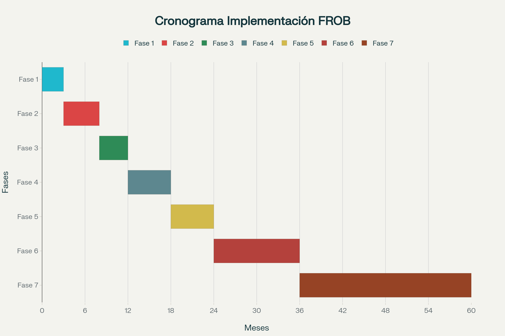

# Cronograma de Implementación

## Visión General: 7 Fases en 60 Meses

---

## FASE 1: Preparación Normativa (Meses 0-3)

### Actividades

**Elaboración técnica**:
- Redacción completa del proyecto de Ley
- Consultas públicas previas
- Análisis de impacto normativo
- Memoria económica detallada

**Coordinación institucional**:
- Grupo de trabajo interministerial (Vivienda, Hacienda, Economía)
- Diálogo con Comunidades Autónomas
- Consulta Federación Española Municipios

**Estud

ios preparatorios**:
- Misiones de estudio: Viena, Ámsterdam, Londres
- Contactos con housing associations europeas
- Análisis mejores prácticas NAMA (Irlanda)

### Entregables

✅ Proyecto de Ley completo  
✅ Borradores reglamentos desarrollo  
✅ Plan financiero detallado  
✅ Estrategia comunicación

---

## FASE 2: Aprobación Legislativa (Meses 3-8)

### Tramitación Parlamentaria

**Congreso de los Diputados** (4 meses):
- Comisión de Vivienda: ponencia, enmiendas, debate
- Pleno del Congreso: votación

**Senado** (2 meses):
- Comisión correspondiente
- Pleno del Senado

**Retorno Congreso** (si enmiendas Senado)

**Sanción Real y publicación BOE**

### Actividades Paralelas

- Diseño institucional detallado de AEVS
- Preparación pliegos de licitación gestores
- Identificación localizaciones delegaciones
- Reclutamiento inicial personal clave

---

## FASE 3: Estructuración Operativa (Meses 8-12)

### Creación de AEVS

**Constitución formal**:
- Nombramiento presidente y director general
- Aprobación estatutos y reglamentos internos
- Registro oficial

**Reclutamiento inicial** (400-600 profesionales):
- **Prioridad**: Personal técnico cualificado de Sareb
- Arquitectos, gestores de activos, juristas
- Trabajadores sociales, economistas
- Equipo tecnológico

**Infraestructura básica**:
- Oficina central Madrid (alquiler)
- Sistemas informáticos básicos
- Procedimientos operativos estándar

### Disolución de FROB y Sareb

**FROB** (plazo máximo 18 meses):
- Cese nuevas operaciones
- Transferencia activos inmobiliarios a AEVS
- Amortización deuda equivalente
- Liquidación activos financieros residuales
- Recolocación personal
- **Extinción formal**

**Sareb** (plazo máximo 24 meses):
- Inventario exhaustivo patrimonio
- Transferencia completa a AEVS
- Cancelación deuda (28.183 M€)
- Rescisión contratos servicers (indemnizaciones contractuales)
- Recolocación prioritaria personal técnico en AEVS
- Disolución mercantil y extinción registral

---

## FASE 4: Inventario y Licitación (Meses 12-18)

### Inventario Completo de Activos

**Clasificación exhaustiva**:
- Inspección técnica 100% viviendas
- Valoración oficial (sociedades tasación)
- Clasificación en Clases A, B, C, D
- Situación jurídica detallada
- Base de datos georreferenciada

### Licitación de Gestores Externos

**Publicación pliegos**:
- Diario Oficial UE (DOUE)
- BOE
- Difusión Housing Europe

**Proceso competitivo** (6 meses):
- Sesiones informativas (presenciales + online)
- Recepción ofertas
- Evaluación por comités técnicos multidisciplinares
- Adjudicación provisional y definitiva
- Formalización 10 contratos de gestión

**Preparación operativa gestores**:
- Constitución equipos locales
- Apertura oficinas proximidad
- Formación personal en procedimientos AEVS
- Integración sistemas tecnológicos

---

## FASE 5: Implementación Piloto (Meses 18-24)

### Provincias Piloto

**Selección** (3-5 provincias):
- Madrid (imprescindible por volumen)
- Alicante o Málaga (perfil costero-turístico)
- Zaragoza o Murcia (ciudades medias)

### Operativa Piloto

**Transferencia inicial**:
- 5.000-8.000 viviendas Clase A (viables inmediatos)
- Gestores ponen en marcha operativa
- Primeras rehabilitaciones ligeras

**Primeras adjudicaciones**:
- Objetivo: 1.000-2.000 viviendas en 6 meses
- Aplicación algoritmos de baremación
- Formalización contratos alquiler social
- Mudanzas y entregas

### Monitoreo Intensivo

- Evaluaciones semanales primeros 3 meses
- Identificación cuellos de botella
- Ajuste procedimientos
- Documentación lecciones aprendidas

---

## FASE 6: Despliegue Nacional (Meses 24-36)

### Expansión Territorial

**Delegaciones AEVS**:
- Apertura 20 delegaciones provinciales
- Plantilla completa (800-1.200 profesionales)

**Activación 10 lotes completos**:
- Transferencia progresiva a todos los gestores
- Objetivo: 40.000-50.000 viviendas/año

### Programa de Rehabilitación

**Escalado masivo**:
- Contratos marco regionales con constructoras
- Obras simultáneas en múltiples provincias
- Objetivo: 20.000-30.000 rehabilitaciones/año

### Construcción Obra Nueva

**Primeras promociones**:
- Suelos Clase C con mayor potencial
- Diseño arquitectónico sostenible
- Licitaciones construcción
- Inicio obras (18-24 meses ejecución)

### Adjudicaciones Generalizadas

- Convocatorias trimestrales
- Objetivo acumulado: 30.000-40.000 familias alojadas

---

## FASE 7: Consolidación (Meses 36-60)

### Operativa Estable

**Parque gestionado**:
- 70.000+ viviendas existentes operativas
- Flujo continuo de adjudicaciones
- Mantenimiento profesionalizado

### Programa de Construcción

**Obra nueva acelerada**:
- 8.000-12.000 viviendas nuevas/año
- Entrega primeras promociones (meses 42-48)
- Pipeline construcción sostenido

### Optimización Continua

**Mejora de procesos**:
- Análisis datos agregados
- Benchmarking entre gestores
- Identificación mejores prácticas
- Replicación en todos los lotes

### Evaluación Comparativa

**Ranking público de gestores**:
- Indicadores de desempeño publicados
- Incentivos gestores top performers
- Planes de mejora para under performers
- Preparación renovaciones contractuales

---

## Hitos Clave

| Mes | Hito |
|-----|------|
| **3** | Proyecto Ley presentado al Congreso |
| **8** | Ley aprobada y publicada BOE |
| **12** | AEVS constituida, FROB/Sareb en disolución |
| **18** | Inventario completo, gestores adjudicados |
| **24** | Piloto completado, 2.000 familias alojadas |
| **30** | FROB/Sareb disueltos completamente |
| **36** | Despliegue nacional, 40.000 familias alojadas |
| **48** | Primeras viviendas nuevas entregadas |
| **60** | Programa consolidado, 70.000+ viviendas operativas |

---

## Riesgos y Mitigaciones

| Riesgo | Probabilidad | Impacto | Mitigación |
|--------|--------------|---------|------------|
| Bloqueo parlamentario | Media | Alto | Opción referéndum (Art. 92 CE) |
| Resistencia bancaria | Media | Medio | Capacidad pago demostrada, presión pública |
| Retrasos burocráticos | Alta | Medio | Procedimientos acelerados, ventanilla única |
| Problemas jurídicos activos | Alta | Medio | Equipo jurídico especializado, fast-track judicial |
| Escasez gestores cualificados | Baja | Alto | Licitación internacional, incentivos atractivos |
| Conflictos competenciales CCAA | Media | Medio | Coordinación Conferencia Sectorial, respeto competencias |

---

## Conclusión

El cronograma de 60 meses es **ambicioso pero realista**:

✅ Fases secuenciales lógicas  
✅ Hitos verificables  
✅ Contingencias contempladas  
✅ Basado en experiencia NAMA (Irlanda)  
✅ Incluye piloto previo a despliegue  
✅ Tiempo suficiente para calidad

**Al final del mes 60**: España habrá transformado 35.000 M€ de deuda improductiva en el mayor parque de vivienda social de su democracia, con **400.000 viviendas** potenciales y **70.000+ ya operativas** beneficiando a familias vulnerables.

[← Volver al índice](../README.md)
